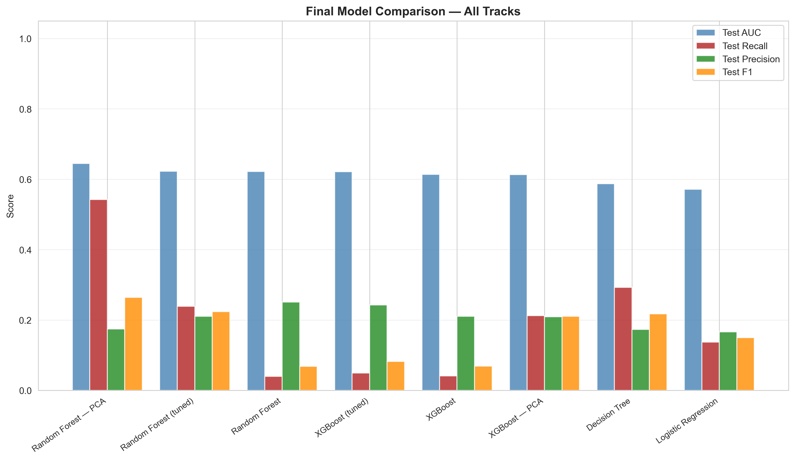
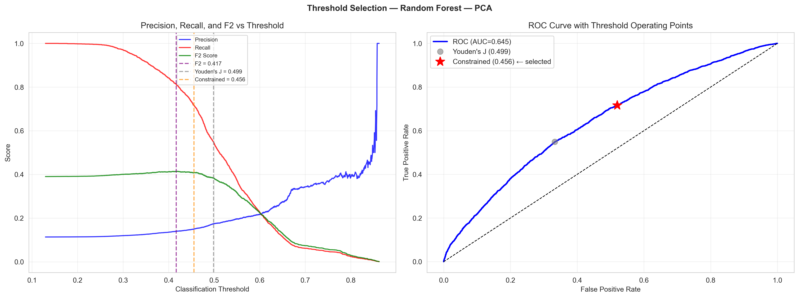
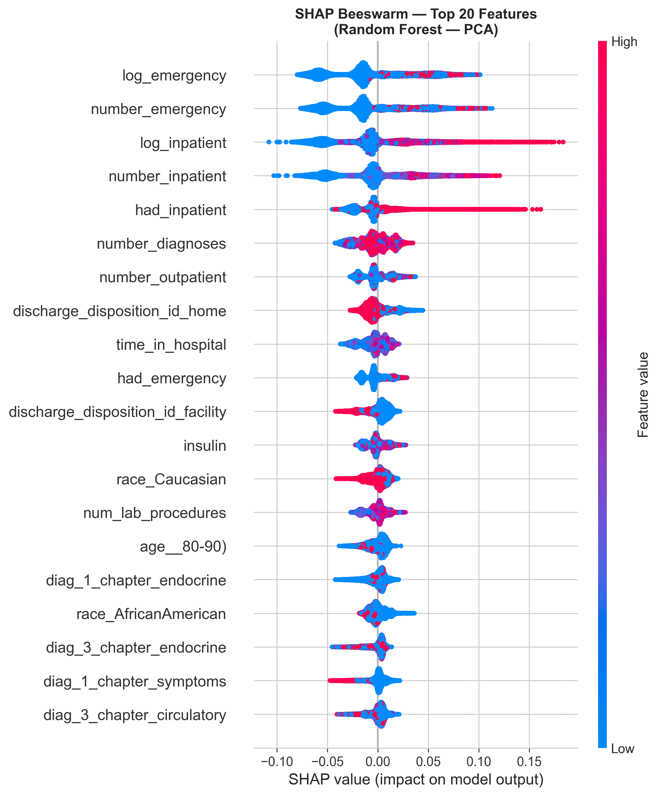
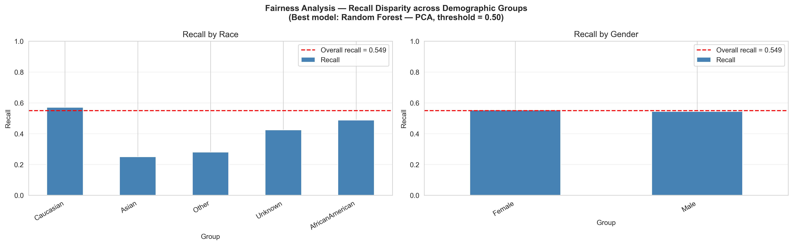

# Final Report: Predicting 30-Day Hospital Readmission for Diabetic Patients

**Author:** Jose Fernando Gonzales  
**Project Type:** Machine Learning Capstone Project  
**Date:** March 26, 2026

## Executive Summary

This project developed and evaluated a machine learning pipeline to predict whether a diabetic patient would be readmitted to the hospital within 30 days of discharge. The problem was framed as a binary classification task with explicit emphasis on recall because failing to identify a truly high-risk patient is more costly in practice than incorrectly flagging a lower-risk patient.

The final pipeline integrates data cleaning, exploratory analysis, clinically informed feature engineering, feature selection, dimensionality reduction, model comparison, threshold optimization, explainability, fairness analysis, and deployment-oriented artifact export. The strongest overall model was a Random Forest trained on a PCA-reduced representation of the engineered feature set.

Headline results:

| Metric | Target | Achieved |
|---|---:|---:|
| Test AUC-ROC | 0.75 | 0.6446 |
| Recall at selected threshold | 0.50 | 0.7164 |
| Precision at selected threshold | 0.15 floor | 0.1500 |
| F1 at selected threshold | N/A | 0.2481 |
| Racial recall gap | <= 0.15 | 0.2189 |

The selected model did not reach the original AUC-ROC target, but it did exceed the recall target and produced an operationally defensible screening threshold. A Constrained threshold strategy was selected because it maximized recall while preserving a minimum precision floor of 15 percent. At that operating point, the model captures roughly 72 percent of true 30-day readmissions while flagging about 54 percent of patients for follow-up intervention.

This outcome suggests that the model is better suited as a recall-oriented screening aid than as a highly discriminative standalone risk scorer. The strongest predictive signals were prior inpatient and emergency utilization, diagnosis burden, and markers of encounter complexity. Fairness analysis showed more stable performance across gender than across race, with subgroup recall differences that warrant monitoring and future mitigation.

## 1. Introduction and Business Context

Hospital readmissions are costly, resource-intensive, and frequently used as an indicator of care quality. For diabetic patients, the risk of short-term readmission is especially important because the condition is chronic, often comorbid, and sensitive to medication management, access to care, and discharge planning quality.

The goal of this project was to build a practical machine learning system that can identify patients at elevated risk of 30-day readmission early enough to support intervention planning. In a real hospital workflow, this could support transitional care teams, discharge coordinators, and care managers in prioritizing patients for additional review, education, scheduling, or follow-up.

The project was intentionally designed around the asymmetric cost of prediction errors. A false negative may allow a high-risk patient to leave without additional support. A false positive may still consume resources, but the downstream harm is typically lower. That cost structure justifies emphasizing recall at the selected operating threshold rather than optimizing only for a default classifier threshold or raw accuracy.

## 2. Problem Statement and Success Criteria

The project predicts whether a diabetic patient will be readmitted within 30 days of discharge.

- Positive class: `readmitted = <30`
- Negative class: `readmitted = NO` or `readmitted = >30`

The project defined three success criteria:

| Criterion | Purpose | Target |
|---|---|---:|
| Test AUC-ROC | Primary discrimination metric | >= 0.75 |
| Recall at operating threshold | Recall-priority decision metric | >= 0.50 |
| Racial recall gap | Fairness safeguard | <= 0.15 |

Accuracy was not treated as a primary evaluation metric because the class distribution is imbalanced and accuracy can be inflated by favoring the majority class. Instead, AUC-ROC, recall, precision, F1-score, confusion matrices, and subgroup metrics were used to evaluate the full tradeoff profile.

## 3. Dataset Overview

The dataset used in this project is the Diabetes 130-US Hospitals for Years 1999-2008 dataset, commonly distributed through both the UCI Machine Learning Repository and Kaggle mirrors.

### 3.1 Source Profile

| Attribute | Value |
|---|---|
| Observation unit | Hospital encounter |
| Raw records | 101,766 |
| Raw features | 50 |
| Hospital coverage | 130 U.S. hospitals |
| Time span | 1999-2008 |
| Task | Binary classification of 30-day readmission |

### 3.2 Target Distribution

The raw target distribution is strongly imbalanced:

| Outcome | Share of records |
|---|---:|
| `<30` | 11.16% |
| `>30` | 34.93% |
| `NO` | 53.91% |

For modeling, the positive class is defined as `<30`, and the two non-positive outcomes are grouped into the negative class. This yields an effective positive prevalence of approximately 11 percent, or about an 8:1 imbalance ratio.

### 3.3 Cohort Notes

The cleaned dataset saved to `data/processed/diabetic_data_cleaned.csv` contains 101,766 rows and 44 columns after the initial field-reduction step. Downstream preprocessing also excludes 1,671 encounters with discharge outcomes that make 30-day readmission structurally impossible, producing the valid modeling cohort used for train-test splitting.

## 4. Data Dictionary and Data Quality Assessment

### 4.1 Raw Feature Families

The original 50 columns can be grouped into six major families.

| Family | Representative fields | Role in analysis |
|---|---|---|
| Identifiers | `encounter_id`, `patient_nbr` | Administrative keys only; dropped before modeling |
| Demographics | `race`, `gender`, `age`, `weight` | Population profiling, fairness analysis, and risk segmentation |
| Admission and discharge context | `admission_type_id`, `discharge_disposition_id`, `admission_source_id`, `medical_specialty`, `payer_code`, `time_in_hospital` | Captures care pathway, access, and severity proxies |
| Encounter intensity | `num_lab_procedures`, `num_procedures`, `num_medications`, `number_diagnoses` | Measures complexity of the hospital stay |
| Prior utilization | `number_outpatient`, `number_emergency`, `number_inpatient` | Strongest historical risk signals |
| Clinical, test, and medication fields | `diag_1`, `diag_2`, `diag_3`, `max_glu_serum`, `A1Cresult`, `change`, `diabetesMed`, and medication-status columns | Captures diagnoses, testing, treatment patterns, and medication adjustments |

### 4.2 Data Quality Issues

The notebooks identified several notable data quality characteristics.

| Issue | Evidence | Treatment |
|---|---|---|
| `?` used as missing marker | Present in multiple fields rather than explicit NaN | Re-coded during preprocessing |
| Very high missingness in `weight` | Roughly 97% missing | Dropped |
| High missingness in `payer_code` | Roughly 40% missing and weak clinical value | Dropped |
| High missingness in `medical_specialty` | Roughly 49% missing | Retained, grouped into `Other` and `Unknown` |
| Low missingness in `race` | About 2.23% missing | Retained, recoded to `Unknown` |
| Constant medication columns | `examide`, `citoglipton` | Dropped |
| Structurally impossible readmissions | Expired and hospice-related discharge codes | Removed before modeling |

### 4.3 Leakage and Structural Filtering

The most important data-quality decision was filtering records with discharge outcomes that make readmission impossible by definition. The notebooks identify discharge disposition codes `{11, 17, 19, 20, 27}` as leakage-prone categories because these patients were expired, hospice-related, or otherwise structurally non-readmittable. The preprocessing pipeline removes 1,671 such encounters before modeling.

This step is critical because retaining these records would create a trivial negative signal that inflates model performance without improving clinically useful discrimination.

## 5. Exploratory Data Analysis

Exploratory data analysis was performed to understand the population, quantify imbalance, identify clinically meaningful signals, and shape feature-engineering decisions.

### 5.1 Univariate Analysis

Key univariate findings include:

- The target is highly imbalanced, with only 11.16 percent of encounters readmitted within 30 days.
- The cohort is older: approximately 67 percent of patients are age 60 or above.
- The race distribution is heavily concentrated in Caucasian patients at about 74.78 percent, followed by African American patients at about 18.88 percent.
- The gender split is near-balanced, with a slight female majority.
- Emergency admissions dominate the cohort, representing roughly 53 percent of cases.
- Historical utilization variables are strongly zero-inflated: most patients have zero prior emergency, inpatient, or outpatient visits in the relevant observation window.
- Laboratory testing is sparse in two clinically important fields: about 94.7 percent of encounters have no glucose serum result and about 83.3 percent have no recorded A1C result.

These findings already suggest a challenging prediction problem: skewed count variables, sparse clinical tests, heterogeneous administrative coding, and a heavily imbalanced positive class.

### 5.2 Bivariate Analysis

Bivariate analysis focused on how readmission rates vary by demographic, clinical, treatment, and utilization features.

The strongest numerical signal comes from prior utilization. Patients readmitted within 30 days had a mean prior inpatient visit count approximately 117.9 percent higher than non-readmitted patients, and a mean prior emergency visit count approximately 100.6 percent higher. The absolute differences are modest because the variables are zero-inflated, but the relative separation is substantial and clinically plausible.

Discharge disposition is one of the strongest administrative predictors. Patients discharged to skilled nursing or rehabilitation settings show much higher readmission rates than patients discharged home, while expired or hospice-related discharge categories produce structural zeros and therefore must be handled as leakage rather than genuine predictive signals.

Age shows a non-monotonic pattern rather than a simple linear gradient. Older cohorts carry elevated risk overall, but some younger bands show pockets of unusually high readmission, which supports the decision to one-hot encode age categories instead of imposing an ordinal relationship.

Medication and treatment patterns also contribute signal, particularly insulin-related status and diabetes medication changes, but these effects are more subtle and context-dependent than utilization history or discharge context.

### 5.3 Correlation Analysis

Correlation analysis showed weak linear relationships between most features and the binary target, which is consistent with a non-linear clinical prediction problem. Some redundancy exists among encounter-intensity variables such as procedure counts, medication counts, and lab volume, but the relationships are not strong enough to justify aggressive manual pruning before model-based selection.

This pattern supports the eventual use of tree-based models, mutual-information feature selection, and PCA for compression rather than relying only on linear correlation screening.

## 6. Data Preprocessing and Feature Engineering

The project implemented a structured preprocessing and feature-engineering pipeline designed to reduce leakage, preserve clinically meaningful signal, and create multiple modeling-ready representations.

### 6.1 Cleaning and Standardization

The first stage of preprocessing included:

- Missing-value inspection using `?` as the dataset-specific null marker
- Removal of identifier fields and constant-value columns
- Removal of highly sparse low-value columns such as `weight` and `payer_code`
- Re-labeling missing `race` values as `Unknown`
- Grouping rare `medical_specialty` values into `Other` and missing values into `Unknown`
- Type correction for coded administrative variables
- Retention of clinically plausible outliers in utilization variables rather than deleting them

Outlier removal was intentionally avoided. Extreme values in utilization history are rare but clinically valid and are exactly the kind of cases likely to be high-risk for readmission.

### 6.2 Leakage Filtering

Before feature engineering, structurally non-readmittable encounters were removed using discharge disposition filtering. This ensured the model learned clinically relevant patterns rather than exploiting impossible outcomes.

### 6.3 Feature Engineering Pipeline

The final pipeline can be summarized as follows.

| Step | Transformation | Purpose |
|---|---|---|
| 1 | ICD-9 diagnosis grouping | Reduce diagnosis-cardinality and improve clinical interpretability |
| 2 | Utilization feature engineering | Create binary utilization flags and log transforms for skewed counts |
| 3 | Administrative recoding | Group admission type, discharge disposition, and admission source into clinically coherent buckets |
| 4 | Age one-hot encoding | Preserve non-monotonic age effects |
| 5 | Medication ordinal encoding | Encode `No`, `Steady`, `Down`, `Up` status consistently |
| 6 | Remaining categorical one-hot encoding | Convert mixed clinical and administrative categories into model-ready features |
| 7 | Stratified train-test split | Preserve class proportions in evaluation |
| 8 | StandardScaler on continuous features | Support linear models and PCA |
| 9 | Mutual Information selection | Retain the most informative engineered features |
| 10 | PCA dimensionality reduction | Compress feature space while retaining most variance |
| 11 | SMOTE on training data only | Address class imbalance without contaminating the test set |

### 6.4 Engineered Feature Representations

The pipeline created three feature tracks for modeling.

| Track | Description | Intended model family |
|---|---|---|
| Selected | 117 mutual-information-selected features | Tree-based models |
| Scaled | 117 selected features after scaling continuous fields | Linear models |
| PCA | 44 principal components from the selected feature set | Compressed benchmark track |

The one-hot encoding stage produced 170 engineered predictor columns. Mutual information reduced this to 117 features, and PCA further reduced it to 44 components while retaining 95.21 percent of total variance.

### 6.5 Train-Test Split and Resampling

After leakage filtering, the valid modeling cohort was split into:

- Training set: 80,076 encounters
- Test set: 20,019 encounters

SMOTE was applied only to the training data, yielding a balanced training set of 141,980 rows. The test set was intentionally left imbalanced to preserve realistic deployment conditions.

## 7. Modeling Methodology

### 7.1 Model Families

Four candidate models were evaluated:

- Logistic Regression
- Decision Tree
- Random Forest
- XGBoost

These models were chosen to compare simple linear structure, single-tree interpretability, and stronger ensemble learners that can capture non-linear interactions.

### 7.2 Honest Validation Design

The project used an `imblearn.Pipeline` to apply SMOTE inside each cross-validation fold during model evaluation and hyperparameter tuning. This is a critical methodological choice. Applying SMOTE before cross-validation would allow synthetic samples derived from nearby minority cases to influence both training and validation folds, inflating performance estimates.

Using SMOTE inside each fold prevents leakage and yields more honest validation metrics.

### 7.3 Hyperparameter Tuning

The top-performing ensemble models from the baseline comparison, Random Forest and XGBoost, were tuned using `RandomizedSearchCV` with:

- 20 random parameter configurations
- 3-fold cross-validation
- `roc_auc` as the optimization target
- inner-fold SMOTE through the modeling pipeline

This design prioritized time-bounded exploration over exhaustive search while keeping the evaluation methodology sound.

### 7.4 Model Selection Rule

The final model was selected by highest test AUC-ROC across all baseline, tuned, and PCA-track candidates. After that selection, threshold optimization was performed only on the winning model to avoid choosing a threshold for a model that would not be deployed.

## 8. Results

### 8.1 Consolidated Model Comparison

| Model | Test AUC | Test Recall | Test Precision | Test F1 |
|---|---:|---:|---:|---:|
| Random Forest - PCA | 0.6446 | 0.5425 | 0.1746 | 0.2642 |
| Random Forest (tuned) | 0.6224 | 0.2391 | 0.2104 | 0.2238 |
| Random Forest | 0.6218 | 0.0396 | 0.2507 | 0.0684 |
| XGBoost (tuned) | 0.6213 | 0.0493 | 0.2430 | 0.0820 |
| XGBoost | 0.6134 | 0.0414 | 0.2103 | 0.0692 |
| XGBoost - PCA | 0.6128 | 0.2122 | 0.2089 | 0.2106 |
| Decision Tree | 0.5874 | 0.2928 | 0.1730 | 0.2175 |
| Logistic Regression | 0.5715 | 0.1369 | 0.1660 | 0.1501 |

The Random Forest trained on the PCA track achieved the highest test AUC-ROC and was selected as the final model.

### 8.2 Threshold Optimization

The default classifier threshold of 0.50 was not accepted automatically because the project explicitly prioritizes recall. Three threshold strategies were compared.

| Strategy | Threshold | Recall | Precision | F1 | F2 | Flagged % |
|---|---:|---:|---:|---:|---:|---:|
| Default (0.50) | 0.5000 | 0.5425 | 0.1746 | 0.2642 | 0.3816 | 35.3 |
| F2 Score (max) | 0.4166 | 0.8142 | 0.1399 | 0.2388 | 0.4146 | 66.0 |
| Youden's J | 0.4986 | 0.5491 | 0.1743 | 0.2646 | 0.3839 | 35.7 |
| Constrained (prec>=15%) | 0.4556 | 0.7164 | 0.1500 | 0.2481 | 0.4082 | 54.2 |

The Constrained strategy was selected because it aligns best with the clinical objective. F2 maximized recall but flagged too many patients for follow-up. Youden's J preserved a more balanced threshold but did not prioritize recall enough for a cost-sensitive readmission problem. The Constrained threshold captured a larger fraction of true readmissions while enforcing a minimum precision floor.

### 8.3 Performance Against Targets

| Criterion | Target | Achieved | Status |
|---|---:|---:|---|
| AUC-ROC | 0.75 | 0.6446 | Not met |
| Recall @ threshold | 0.50 | 0.7164 | Met |
| Racial recall gap | 0.15 | 0.2189 | Not met |

### 8.4 Interpretation of the Result

The final AUC-ROC is below the original target, but this does not mean the project failed. This dataset is known to be difficult: it is class-imbalanced, historically bounded, administratively coded, and missing richer temporal clinical signals such as lab trajectories, medication adherence, and outpatient follow-up details. Within that context, the ability to push recall above 0.70 at a controlled precision floor is still operationally valuable for triage and care management.

## 9. Explainability Analysis

### 9.1 SHAP Methodology

The project used SHAP to explain the final model. Because the winning model uses PCA-transformed inputs, SHAP values were first computed in PCA space and then back-projected into the original 117-feature space using the PCA loadings. This step is essential: without it, the explanation would remain at the component level and lose much of its clinical interpretability.

### 9.2 Top Drivers

The top features by mean absolute SHAP value were:

1. `log_emergency`
2. `number_emergency`
3. `log_inpatient`
4. `number_inpatient`
5. `had_inpatient`
6. `number_diagnoses`
7. `number_outpatient`
8. `discharge_disposition_id_home`
9. `time_in_hospital`
10. `had_emergency`

These features map naturally into three higher-level themes.

| Theme | Features | Interpretation |
|---|---|---|
| Prior utilization | Emergency and inpatient history | Repeated acute-care use signals chronic instability and unresolved disease burden |
| Encounter complexity | Diagnosis count, time in hospital, outpatient activity | More complex encounters are associated with higher short-term risk |
| Discharge pathway | Home discharge vs. facility-style destinations | Discharge home is relatively protective, while more intensive disposition pathways imply higher severity |

### 9.3 Clinical Interpretation

The strongest predictors are clinically coherent. A patient with frequent recent emergency or inpatient utilization is more likely to have unstable chronic disease management, residual complications, or unmet outpatient needs. Likewise, higher diagnosis burden and longer stays are consistent with clinical complexity.

One practical implication is that the highest-value signals are available relatively early in the encounter, especially utilization history. That means a care management workflow could flag high-risk patients before discharge planning is complete.

## 10. Bias and Fairness Analysis

Fairness analysis was performed on race and gender subgroups using the optimized threshold. The project used subgroup recall as the primary fairness lens because recall is the metric most aligned with the business cost structure.

### 10.1 Race Subgroup Results

| Group | N | Positive Rate | AUC-ROC | Recall | Precision | F1 |
|---|---:|---:|---:|---:|---:|---:|
| Caucasian | 15103 | 0.1143 | 0.6451 | 0.7389 | 0.1492 | 0.2482 |
| AfricanAmerican | 3712 | 0.1158 | 0.6396 | 0.6558 | 0.1573 | 0.2537 |
| Asian | 121 | 0.0992 | 0.6514 | 0.5833 | 0.1750 | 0.2692 |
| Other | 270 | 0.0926 | 0.5535 | 0.5200 | 0.0977 | 0.1646 |
| Unknown | 433 | 0.0762 | 0.6958 | 0.5455 | 0.1250 | 0.2034 |

The racial recall gap is computed as the difference between the maximum and minimum subgroup recall values:

- Maximum recall: 0.7389
- Minimum recall: 0.5200
- Gap: 0.2189

This exceeds the project fairness target of 0.15.

### 10.2 Gender Subgroup Results

| Group | N | Positive Rate | AUC-ROC | Recall | Precision | F1 |
|---|---:|---:|---:|---:|---:|---:|
| Female | 10805 | 0.1155 | 0.6405 | 0.7228 | 0.1513 | 0.2503 |
| Male | 9213 | 0.1110 | 0.6491 | 0.7087 | 0.1484 | 0.2454 |

Performance is comparatively stable across gender, with only a small recall difference.

### 10.3 Fairness Interpretation

The subgroup results suggest that the model is more stable across gender than across race. The weaker performance for some racial subgroups is likely influenced by sample-size imbalance, representation differences, and the fact that the dataset itself is not demographically balanced.

This does not invalidate the model, but it does limit claims of equitable performance. Any real deployment of this system should include subgroup monitoring, threshold review, and periodic fairness re-audits.

## 11. Deployment Readiness and Reproducibility

The project does more than compare models in a notebook. It also exports reproducible artifacts suitable for reuse and downstream integration.

### 11.1 Exported Artifacts

| Path | Purpose |
|---|---|
| `models/best_model_random_forest_pca.joblib` | Final trained model |
| `models/best_model_metadata.json` | Metrics, threshold, and metadata |
| `models/deployment_pipeline.joblib` | End-to-end inference pipeline |
| `models/selected_features.json` | Selected feature list |
| `models/standard_scaler.joblib` | Fitted scaling artifact |
| `models/pca_transformer.joblib` | Fitted PCA transformer |
| `reports/tables/*.csv` | Final result, threshold, fairness, and SHAP tables |
| `reports/figures/*.png` | Exported figures used for reporting |

### 11.2 Reproducibility Controls

The project enforces reproducibility through:

- `RANDOM_STATE = 42`
- fixed train-test split configuration
- consistent artifact export into versioned repository folders
- modular preprocessing and modeling logic in `src/`
- saved processed datasets for downstream reruns

### 11.3 Deployment Position

The project is deployment-ready at the artifact level, but not yet productionized as an application. The inference pipeline is packaged and reloadable, yet operational deployment would still require a scoring service, input validation, logging, monitoring, and governance around threshold updates and subgroup drift.

## 12. Limitations

Several limitations constrain both performance and interpretation.

1. The dataset is strongly imbalanced, making high discrimination difficult even with SMOTE and threshold tuning.
2. The data span ends in 2008, so the model may not generalize cleanly to modern hospital workflows or treatment standards.
3. Many clinically rich temporal signals are absent, including longitudinal lab trends, medication adherence, and outpatient follow-up behavior.
4. Administrative coding introduces noise and may encode institution-specific documentation practices rather than purely clinical risk.
5. Fairness performance is uneven across some racial subgroups.
6. The model is better suited for screening support than as a definitive clinical decision system.

## 13. Conclusion

This project delivered a full end-to-end machine learning pipeline for diabetic 30-day readmission prediction. The final selected model, Random Forest on the PCA track, achieved the strongest AUC-ROC among all tested candidates. More importantly for the stated business objective, threshold optimization produced a recall-oriented operating point that captures roughly 72 percent of true readmissions while preserving a minimum precision floor.

The project demonstrates that a carefully engineered and evaluated pipeline can provide useful screening support even when the dataset limits raw discrimination performance. The most important risk signals are clinically plausible, the exported artifacts support reproducibility, and the final thresholding decision is directly aligned with the problem's asymmetric cost structure.

At the same time, the project also shows the boundary between a technically complete pipeline and a deployable clinical system. Fairness gaps remain, calibration has not been optimized, and broader deployment governance would still be needed.

## 14. Future Work

The most credible next steps are:

1. Expand hyperparameter search using larger budgets or Bayesian optimization.
2. Add probability calibration to improve reliability of risk scores.
3. Evaluate additional model families such as LightGBM or CatBoost.
4. Perform temporal validation on older versus newer hospital periods.
5. Introduce fairness-aware training or threshold review procedures.
6. Build a lightweight API or application layer around the saved deployment pipeline.
7. Add monitoring for concept drift, subgroup drift, and threshold drift.

## 15. References

1. Diabetes 130-US Hospitals for Years 1999-2008 dataset, UCI Machine Learning Repository.
2. Kaggle mirror: Diabetic Patients' Re-admission Prediction.
3. Lundberg, S. M., and Lee, S.-I. A Unified Approach to Interpreting Model Predictions. Advances in Neural Information Processing Systems.
4. Chawla, N. V., et al. SMOTE: Synthetic Minority Over-sampling Technique. Journal of Artificial Intelligence Research.

## Appendix A. Raw Data Dictionary by Feature Family

### A.1 Identifier Fields

| Feature | Type | Description |
|---|---|---|
| `encounter_id` | Numeric | Unique identifier for an encounter |
| `patient_nbr` | Numeric | Unique identifier for a patient |

### A.2 Demographic Fields

| Feature | Type | Description |
|---|---|---|
| `race` | Nominal | Patient race category |
| `gender` | Nominal | Male, Female, or Unknown/Invalid |
| `age` | Nominal | 10-year age bands |
| `weight` | Numeric | Patient weight in pounds |

### A.3 Administrative and Encounter Fields

| Feature | Type | Description |
|---|---|---|
| `admission_type_id` | Nominal | Admission type code |
| `discharge_disposition_id` | Nominal | Discharge outcome code |
| `admission_source_id` | Nominal | Admission source code |
| `time_in_hospital` | Numeric | Length of stay in days |
| `payer_code` | Nominal | Payer category code |
| `medical_specialty` | Nominal | Admitting physician specialty |
| `num_lab_procedures` | Numeric | Number of lab procedures |
| `num_procedures` | Numeric | Number of non-lab procedures |
| `num_medications` | Numeric | Number of medications during encounter |
| `number_outpatient` | Numeric | Outpatient visits in prior year |
| `number_emergency` | Numeric | Emergency visits in prior year |
| `number_inpatient` | Numeric | Inpatient visits in prior year |
| `number_diagnoses` | Numeric | Number of diagnoses recorded |

### A.4 Diagnosis and Test Fields

| Feature | Type | Description |
|---|---|---|
| `diag_1` | Nominal | Primary diagnosis code |
| `diag_2` | Nominal | Secondary diagnosis code |
| `diag_3` | Nominal | Additional diagnosis code |
| `max_glu_serum` | Nominal | Glucose serum test result status/value |
| `A1Cresult` | Nominal | A1C test result status/value |
| `change` | Nominal | Whether diabetic medications changed |
| `diabetesMed` | Nominal | Whether diabetic medication was prescribed |

### A.5 Medication Status Fields

| Feature | Type | Description |
|---|---|---|
| `metformin` | Nominal | Metformin status |
| `repaglinide` | Nominal | Repaglinide status |
| `nateglinide` | Nominal | Nateglinide status |
| `chlorpropamide` | Nominal | Chlorpropamide status |
| `glimepiride` | Nominal | Glimepiride status |
| `acetohexamide` | Nominal | Acetohexamide status |
| `glipizide` | Nominal | Glipizide status |
| `glyburide` | Nominal | Glyburide status |
| `tolbutamide` | Nominal | Tolbutamide status |
| `pioglitazone` | Nominal | Pioglitazone status |
| `rosiglitazone` | Nominal | Rosiglitazone status |
| `acarbose` | Nominal | Acarbose status |
| `miglitol` | Nominal | Miglitol status |
| `troglitazone` | Nominal | Troglitazone status |
| `tolazamide` | Nominal | Tolazamide status |
| `examide` | Nominal | Examide status |
| `citoglipton` | Nominal | Citoglipton status |
| `insulin` | Nominal | Insulin status |
| `glyburide-metformin` | Nominal | Combination medication status |
| `glipizide-metformin` | Nominal | Combination medication status |
| `glimepiride-pioglitazone` | Nominal | Combination medication status |
| `metformin-rosiglitazone` | Nominal | Combination medication status |
| `metformin-pioglitazone` | Nominal | Combination medication status |

### A.6 Target Field

| Feature | Type | Description |
|---|---|---|
| `readmitted` | Nominal | `<30`, `>30`, or `NO` readmission outcome |

## Appendix B. Artifact Inventory

### B.1 Figures

- `fig_pca_variance_v1.png`
- `fig_baseline_roc_v1.png`
- `fig_baseline_confusion_v1.png`
- `fig_pca_comparison_v1.png`
- `fig_model_comparison_v1.png`
- `fig_threshold_analysis_v1.png`
- `fig_confusion_threshold_v1.png`
- `fig_shap_beeswarm_v1.png`
- `fig_shap_bar_v1.png`
- `fig_fairness_recall_v1.png`
- `fig_fairness_auc_v1.png`

### B.2 Tables

- `tbl_model_comparison_v1.csv`
- `tbl_threshold_strategies_v1.csv`
- `tbl_fairness_race_v1.csv`
- `tbl_fairness_gender_v1.csv`
- `tbl_shap_importance_v1.csv`